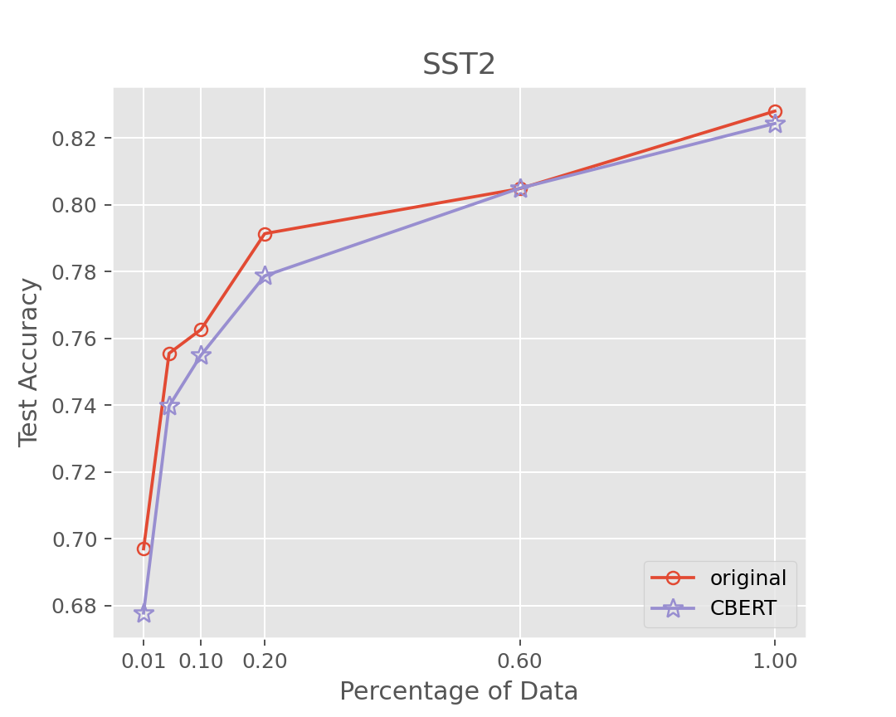

# Comparison of Classification Results Between Original Data and Augmented Data

In stsa2, the classification accuracy with augmented data is *lower* than original data on everey percentage point. 
In TREC, the accuracy using augmented data is only *slightly higher* than the original data and is **negligible**.

    
    &nbsp;&nbsp;&nbsp;&nbsp;&nbsp;&nbsp;
      

